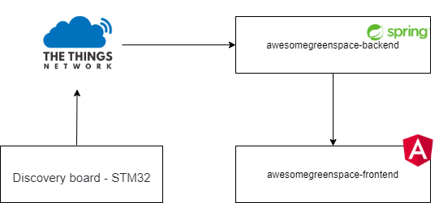

# Make Zurich 2020: Awesome Green Space

The software architecture:

Our software architecture has one or more "Discovery board - STM32" with an SGPC3 from Sensirion.

It inclueds an application on [The Things Network](https://www.thethingsnetwork.org/).

## Discover Board Software
For the discovery board we use the code for the mbed online compiler: https://github.com/maxmayr95/mbed-os-thing-network-sgpc3

Import the code to:https://ide.mbed.com/compiler from the Github Repository. Now you should change your: mbed_app.json file. 

`"lora.device-eui": "{ 0x3D, 0xC3, 0x23, 0xC3, 0x5C, 0x5F, 0xCE, 0x23 }","lora.application-eui": "{ 0xB3, 0x23, 0xD5, 0x7E, 0xD0, 0x03, 0x6E, 0x6A }","lora.application-key": "{ 0x23, 0x7E, 0x3C, 0x7A, 0x71, 0xA8, 0x92, 0xBE, 0x1D, 0x7D, 0x5E, 0x92, 0x5D, 0x5E, 0xF8, 0x26 }"`

You will find this in your [The Things Network Application](https://www.thethingsnetwork.org/).

## Registry Service

The second one is a registry service based on spring boot. [Spring Boot: Backend Registry Service](https://github.com/maxmayr95/awesomegreenspace-backend)

## Angular Frontend

For the logic for the fireplaces we made an [Frontend based on Angular](https://github.com/maxmayr95/awesomegreenspace-frontend)
          
This project was done by me and [@seonbinnn](https://github.com/seonbinnn).
